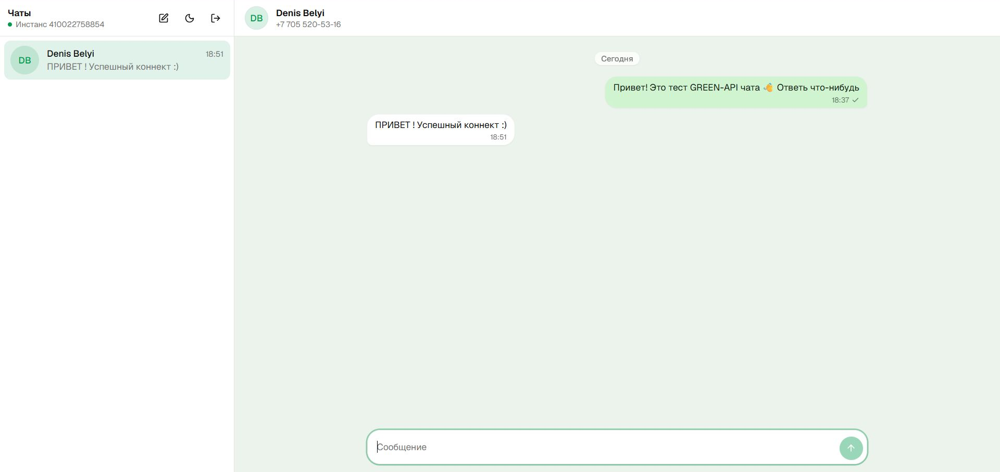
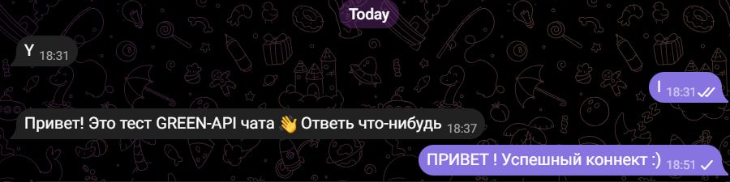
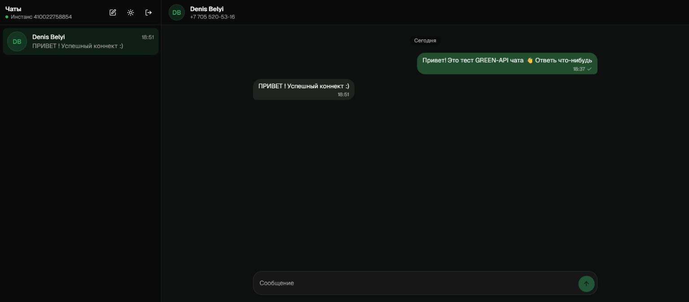
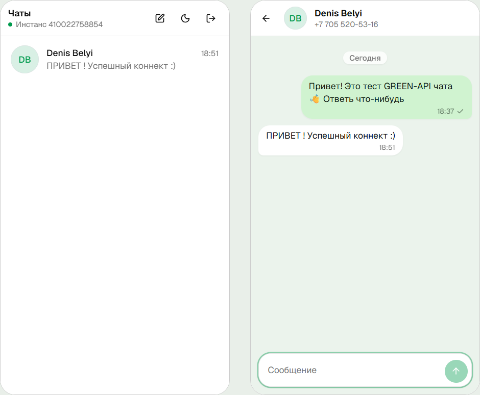
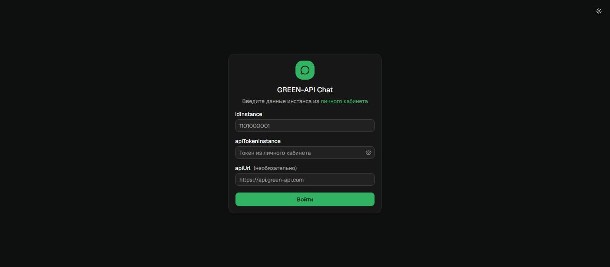

# GREEN-API Chat

Веб-интерфейс для отправки и получения текстовых сообщений в **Telegram** через [GREEN-API](https://green-api.com/).
Тестовое задание на позицию «Фронтенд-разработчик React».
Проверено вручную на реальном Telegram-инстансе: отправка, доставка и ответ получателя (скриншоты ниже).

**Демо:** https://rendersc.github.io/GreenAPI_testTask/



<details>
<summary>Ещё скриншоты: Telegram получателя, тёмная тема, мобильная версия, вход</summary>

**Та же переписка в Telegram у получателя.** Сообщение пришло через API, ответ вернулся в веб-чат:



| Тёмная тема | Мобильная версия |
| --- | --- |
|  |  |



</details>

## Возможности

- Вход по `idInstance` и `apiTokenInstance`; `apiUrl` подставляется автоматически по первым цифрам `idInstance`. Данные проверяются через `getStateInstance`.
- Новый чат по номеру телефона (`+7 900 123-45-67`, `8 900…`) или по `@username`.
- Отправка текста через [`sendMessage`](https://green-api.com/telegram/docs/api/sending/SendMessage/): статусы «отправляется / отправлено / ошибка», повтор отправки, лимит 4096 символов, Enter отправляет, Shift+Enter делает перенос строки.
- Получение ответов через [HTTP API](https://green-api.com/telegram/docs/api/receiving/technology-http-api/): цикл `receiveNotification` → обработка → `deleteNotification` с long-poll.
- Новые личные чаты появляются сами, есть счётчик непрочитанных.
- Чаты и сессия сохраняются в `localStorage`, светлая и тёмная тема, адаптивная вёрстка.

## Запуск

Нужен Node.js 22+.

```bash
git clone https://github.com/RendersC/GreenAPI_testTask.git
cd GreenAPI_testTask
npm install
npm run dev        # http://localhost:5173
```

| Команда | Что делает |
| --- | --- |
| `npm run dev` | dev-сервер Vite |
| `npm run build` | проверка типов и production-сборка в `dist/` |
| `npm run preview` | локальный просмотр сборки |
| `npm test` | тесты (Vitest + Testing Library) |
| `npm run coverage` | тесты с отчётом о покрытии |
| `npm run lint` | линтер (oxlint) |

Сборка статическая (`base: './'`), её можно положить на любой хостинг. Бэкенд не нужен: GREEN-API отдаёт CORS-заголовки, и запросы идут прямо из браузера.

## Подготовка инстанса GREEN-API

1. Зарегистрируйтесь в [console.green-api.com](https://console.green-api.com) и создайте инстанс **Telegram**.
2. Авторизуйте его через QR-код или номер телефона. Статус должен стать `authorized`.
3. В настройках инстанса оставьте **Webhook URL пустым** и включите уведомления о входящих сообщениях. Иначе HTTP API не получит ответы.
4. Скопируйте `idInstance` и `apiTokenInstance` в форму входа.

## Как это устроено

```
src/
  api/greenApi.ts              HTTP-клиент: URL-ы методов, ошибки → понятный текст
  hooks/useNotificationPolling цикл receive → parse → delete, статус соединения
  lib/notifications.ts         уведомление GREEN-API → текстовое сообщение (или null)
  store/chats.ts               чистый reducer: чаты, сообщения, сопоставление ответов
  store/chatStore.tsx          провайдер: reducer + localStorage + отправка
  features/auth, features/chat экраны: вход, список чатов, окно чата, новый чат
  components/ui                shadcn/ui + компоненты с 21st.dev
```

- **Состояние:** `useReducer` + Context без сторонних state-менеджеров. Вся логика в чистом reducer, его легко тестировать.
- **Отправка оптимистичная:** сообщение сразу появляется в ленте, потом получает `idMessage` или статус ошибки.
- **Сопоставление ответов:** входящее сообщение ищет чат по `chatId`, затем по `senderPhoneNumber`, затем по `idMessage` из `outgoingAPIMessageReceived`. Дубли отсекаются по `idMessage`. Групповые чаты и сервисные уведомления игнорируются, но удаляются из очереди, чтобы она не забивалась.
- **UI:** Tailwind CSS v4 и shadcn/ui. Пузыри сообщений и поле ввода взяты с [21st.dev](https://21st.dev) ([Chat Bubble](https://21st.dev/@jakobhoeg/components/chat-bubble), [Prompt Input](https://21st.dev/@tinkerers-labs/components/prompt-input)) и доработаны.

## Особенности Telegram-инстанса GREEN-API

Нашёл при тестировании на реальном инстансе:

1. **Отправка по `номер@c.us` не доходит.** API отвечает `idMessage`, но сообщение не появляется даже в `lastOutgoingMessages`. Как и советует [документация](https://green-api.com/telegram/docs/api/chat-id/), номер сначала превращается в Telegram `chatId` через [`checkAccount`](https://green-api.com/telegram/docs/api/service/CheckAccount/), и отправка идёт уже по нему.
2. **Приватность номера.** Если пользователь запретил находить себя по номеру, `checkAccount` вернёт `exist: false`. Приложение так и сообщит и предложит ввести `@username`.
3. **Пустая очередь отдаёт `408`**, а не пустой ответ. Это обрабатывается как «новых сообщений нет».
4. **`getStateInstance` ограничен по частоте** (`429`). Приложение вызывает его только при входе, а `429` в цикле получения считает «подождать», а не «нет связи».
5. **Ник в ответе `checkAccount` приходит с `@`** (`"@belyi_0071"`), регистр не важен.
6. **Лимит тарифа Developer:** 3 собеседника в месяц (ошибка `466`). Один человек в разных форматах chatId считается разными собеседниками, поэтому приложение всегда пишет по одному `chatId`.

## Тесты

45 тестов, покрытие кода приложения около 92% строк:

- `src/__tests__/App.test.tsx` прогоняет приложение целиком против in-memory имитации GREEN-API ([`src/test/fakeGreenApi.ts`](src/test/fakeGreenApi.ts)): вход → новый чат → отправка → ответ получателя → удаление уведомления из очереди. Плюс неверный токен, неавторизованный инстанс, аккаунт не найден, лимит 466 и повтор, группы, отзыв токена, восстановление после перезагрузки.
- Модульные тесты: HTTP-клиент, reducer, парсинг уведомлений, форматирование.

## Ограничения

- `apiTokenInstance` хранится в `localStorage` браузера: это клиентское приложение без бэкенда. Кнопка «Выйти» его удаляет.
- Очередь уведомлений у инстанса одна. Если открыть приложение в двух вкладках, сообщения распределятся между ними.
- История переписки, которая была до входа, не подгружается. По заданию нужен только обмен новыми сообщениями.
